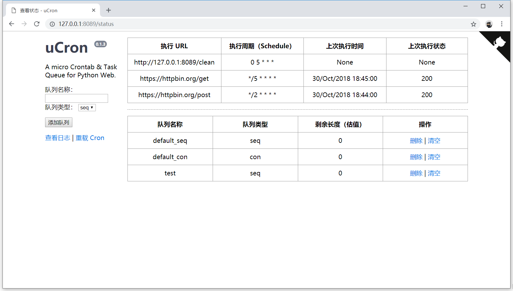

uCron
=====

.. image:: https://img.shields.io/travis/akgnah/ucron/master.svg
    :target: https://travis-ci.org/akgnah/ucron

.. image:: https://img.shields.io/pypi/v/ucron.svg
    :target: https://pypi.python.org/pypi/ucron

.. image:: https://img.shields.io/pypi/l/ucron.svg
    :target: https://pypi.python.org/pypi/ucron

.. image:: https://img.shields.io/badge/code_style-pep8-orange.svg
    :target: https://www.python.org/dev/peps/pep-0008

uCron 是一个微型的执行定时任务（Crontab）和任务队列（Task queue）的小工具，易于安装和运行，配置简单且依赖少。

特别地，如果你使用 Windows，没有 Crontab，这个小工具能为你提供类似的功能。当然它也可在 Linux 上工作。

安装
----

.. code-block:: bash

   $ pip install ucron

程序依赖 bottle，在 Win10 上，Python2.7 和 3.5+ 测试通过，在 Archlinux 上，Python2.7 和 3.3+ 测试通过。

使用
----

.. code-block:: bash

   $ python -m ucron

这是最简单的使用方法，使用浏览器访问 http://127.0.0.1:8089/ 将会看到一个简单的页面。

运行 python -m ucron -h 可查看全部可用参数，简单说明如下：

::

   --host    指定程序运行的 IP，默认为 127.0.0.1。
   --port    指定程序运行的端口，默认为 8089。
   --cron    指定定时任务的配置文件，格式见 ucron.tab 或下文。
   --dbn     指定文件用于 SQLite，默认为 :memory:，即内存模式。
   --log     指定日志文件，默认为当前目录下的 ucron.log。
   --max     指定日志文件的最大行数，默认为 10240。
   --utc     指定时区，默认为 +8。
   --quiet   指定 bottle 的 quiet 选项，默认为 False。
   --reload  指定是否自动重载 ucron.tab，默认为 False。
   --tab     指定清理日志文件的执行周期，默认为每天早上 5 点。
   --add     增加队列，需指定端口、队列名和类型。
   --cls     清空队列，需指定端口和队列名。
   --del     删除队列，需指定端口和队列名。
   --list    列出全部队列和它们的剩余长度，需指定端口。

请注意，当 SQLite 使用内存模式，即 --dbn 使用默认值时，程序关闭时会丢失队列。

典型的使用方法可能是这样：

.. code-block:: bash

   $ python -m ucron --cron ucron.tab

这会读取当前目录下的 ucron.tab 增加定时任务。指定的文件可使用相对或绝对路径。

定时任务
^^^^^^^^

::

   */2 * * * * https://httpbin.org/post hello=world&text=test POST

这是 ucron.tab 中的一行，它使用和 Crontab 类似的格式，每行为一个任务，每个任务有四个部分，使用空格分隔，最后两个部分均为可选。

第一部分是执行周期，使用和标准 Crontab 一致的格式；第二部分是要访问的地址；第三部分是提供给地址的数据，使用 key1=value1&key2=value2 的格式；最后一部分是访问方法，可为 GET 或 POST，默认为 GET。第三、四部分均为可选，也可忽略第三部分直接提供第四部分。

请注意各个部分使用空格来分隔，也正因为如此，所以 URL 或参数中不能含有空格。读取配置时会忽略以 # 开始的行。

如果在运行中修改了该配置文件，并且没有指定 --reload 为真，那么需要访问 http://127.0.0.1:8089/reload 以使配置生效（假设使用了默认端口 8089，下同）。还有一点很重要，请使用 UTF-8 编码保存 ucron.tab。

如果你不熟悉 Crontab 格式，这个在线 `Crontab 编辑器 <https://crontab.guru/>`_ 可能会有帮助。

任务队列
^^^^^^^^

要添加任务到队列中很简单：

.. code-block:: python

   from ucron import add_task

   body = {'page': 1, 'text': '测试'}
   resp = add_task('http://setq.me', body, method='GET')
   print(resp)

add_task 方法接受的参数有 path、args、method、name、port、host 和 json，其中只有 path 是必需的，其他均为可选参数。

path 是要访问的地址，args 为发送给地址的数据，接受一个字典，默认为空字符串，method 可为 GET 或 POST，默认为 GET。

name 是队列名，默认为 default_seq，这个参数在下面会有详细说明。port 默认为 8089，host 默认为 127.0.0.1。

在最新版本中，你还可以把字典传给 add_task 的 json 参数，此时会把 Content-Type header 设置为 application/json 并发送 POST 请求。 

队列类型
^^^^^^^^

uCron 中的任务队列有顺序队列和并发队列两种类型。程序在运行的时候会新建两个默认的队列，default_seq 和 default_con，分别对应着顺序队列和并发队列。你也可以自己增加队列并在 add_task 中指定 name 参数。

有三种方法创建队列：

.. code-block:: bash

   $ python -m ucron --add 8089 bot_seq seq

这会向 8089 端口运行着的 uCron 增加一个名为 bot_seq 的顺序（seq）队列。

.. code-block:: python

   from ucron import add_queue

   add_queue('bot_con', 'con', port='8089')

这会向 8089 端口运行着的 uCron 增加一个名为 bot_con 的并发（con）队列。

向新建的队列添加任务：

.. code-block:: python

   from ucron import add_task

   for i in range(500):  # 顺序队列
       body = {'page': i}
       add_task('http://setq.me', body, name='bot_seq')

   for i in range(500):  # 并发队列
       body = {'page': i}
       add_task('http://setq.me', body, name='bot_con')

同样也有三种方法删除队列：

.. code-block:: bash

   $ python -m ucron --del 8089 bot_seq

这会删除刚才增加的 bot_seq 队列。

.. code-block:: python

   from ucron import del_queue

   del_queue('bot_con', port='8089')

这会删除刚才增加的 bot_con 队列。

第二种方法为代码在运行时临时增删队列提供了便利。第三种方法是使用浏览器访问 http://127.0.0.1:8089/ 进行操作。提醒一下，并发队列不保证严格有序。

add_task、add_queue 和 del_queue 均定义在 ucron/ext.py 中，它们都很简单，请查看以了解更多详情。

杂项
----
这个小工具产生于我写饭否机器人的过程中，由于当时不知道已经存在很多优秀的类似工具，如 `schedule <https://github.com/dbader/schedule>`_ 和 `Celery <https://github.com/celery/celery>`_ ，所以重复造了轮子，但造轮子还是挺开心的。

最后，感谢使用，若有疑问或建议请 Email 联系我。
